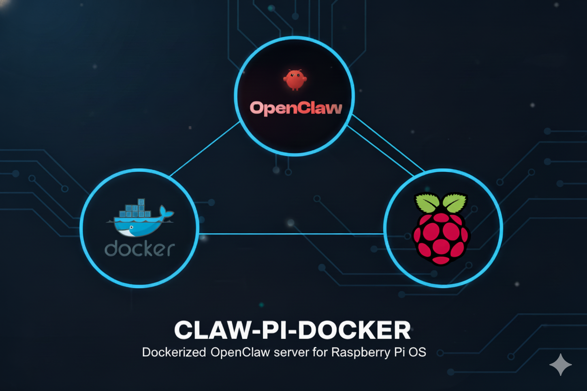

# claw-pi-docker
Dockerized OpenClaw server for Raspberry Pi OS.

## Setup guide

Follow the steps below in order. Each has a detailed guide — click the link to open the corresponding README.

- [1. Raspberry Pi OS](#1-raspberry-pi-os) — prepare the system on the Raspberry (OS image, SSH, network, etc.).
- [2. Docker](#2-docker) — install and configure Docker on the Pi to run containers.
- [3. Open-Claw](#3-open-claw) — set up and run the OpenClaw server in a container.

---

### 1. Raspberry Pi OS

Server foundation: write the Raspberry Pi OS image to the SD card, configure user, SSH, and network. Without this step the Pi won’t be ready for the next steps.

**Full guide:** [config/pi-OS/README.md](config/pi-OS/README.md)

### 2. Docker

Docker installation on the Raspberry Pi (quick method or official repository). Required to run OpenClaw in a container.

**Full guide:** [config/docker/README.md](config/docker/README.md)

### 3. Open-Claw

Project setup with Dockerfile and docker-compose, container build, onboarding, and access to the OpenClaw dashboard.

**Full guide:** [config/open-claw/README.md](config/open-claw/README.md)

---

## Useful Commands

Useful Commands for Monitoring the Container and Server:

| O que fazer | Comando |
|-------------|---------|
| View CPU/memory usage for the Open-Claw container | `docker stats open-claw` |
| View server processes (interactive) | `htop` |
| Check server CPU temperature (Raspberry Pi) | `vcgencmd measure_temp` |

